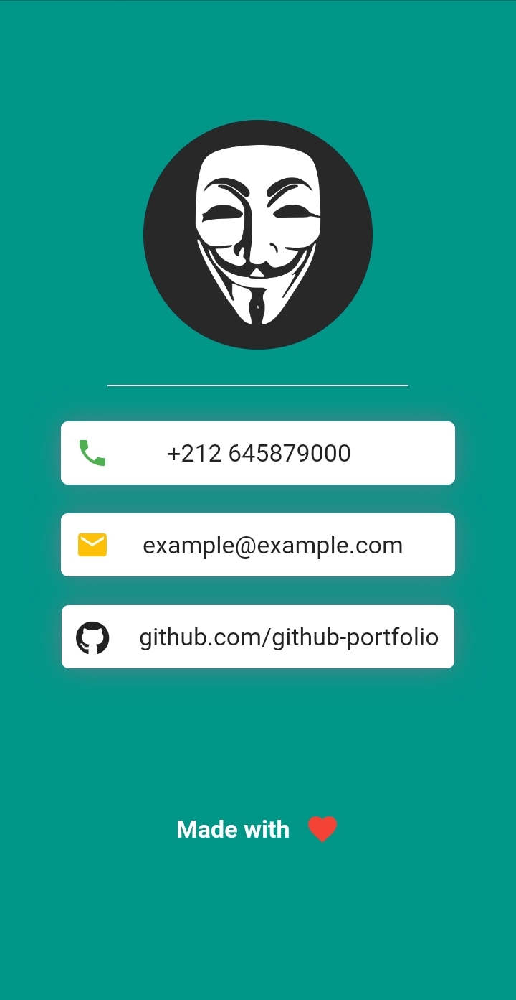

# Developer ID Card

This is a beginner level Flutter project made to help new Flutter developers grasp the basics of this framework.

## Getting Started

This project was made in a live session on a discord server called 'The Coding Gang' TCG for short.

## Flutter Packages Used

FontAwesomeIcons were used to enhance the icons library in this simple app.
The package name is [font_awesome_flutter](https://pub.dev/packages/font_awesome_flutter)

## About The App

This app was developped on an Android device(My Phone). 
No emulators were used in the development process.

## App Preview

### Side Notes
If you are a Moroccan and you want to learn new things in different fields of programming,
Consider joining our [Discord Server](https://discord.gg/UCFpUVBpS) where you can meet programmers and software developpers of different interests and specialties.

